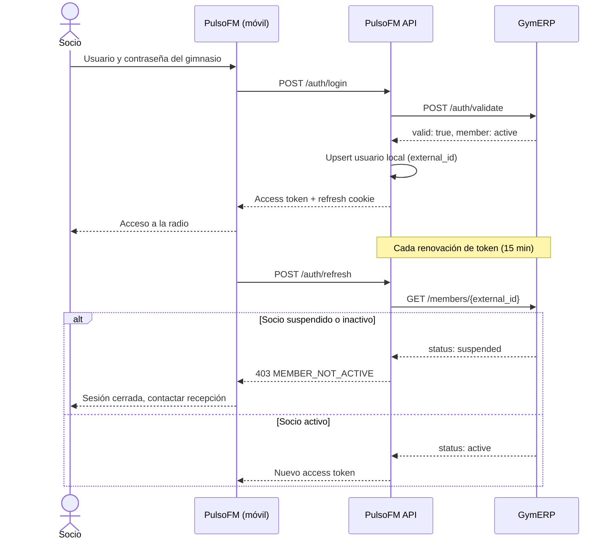

# Integración con el ERP — ejemplo

> Este documento usa un **ERP ficticio** llamado `GymERP` para mostrar cómo PulsoFM se conecta a un sistema de gestión del gimnasio. Cuando se conozca el ERP real, se reemplazan los endpoints y el mapeo de campos, pero el flujo y las reglas no cambian.

---

## 1. Qué necesita PulsoFM del ERP

| Necesidad                     | Para qué                                    |
| ----------------------------- | ------------------------------------------- |
| Validar usuario y contraseña  | Login de socios con sus mismas credenciales |
| Consultar el estado del socio | Bloquear acceso si está suspendido o moroso |
| Listar socios modificados     | Sincronización de respaldo (pull)           |
| Recibir cambios de socios     | Sincronización en tiempo real (push)        |

El ERP es la **fuente de verdad** de identidad y estado. PulsoFM guarda solo lo necesario (`external_id`, nombre, rol local y estado copiado).

---

## 2. Contrato del ERP ficticio (`GymERP`)

Base: `https://erp.gimnasio.local/api/v1`. Autenticación entre sistemas con **API key** en el header `X-Api-Key`.

### 2.1 Validar credenciales

```http
POST /auth/validate
Content-Type: application/json
X-Api-Key: <clave-de-la-integración>

{
  "username": "maria.lopez",
  "password": "••••••••"
}
```

Respuesta `200` si las credenciales son correctas:

```json
{
  "valid": true,
  "member": {
    "id": "M-10482",
    "fullName": "María López",
    "status": "active",
    "plan": "Mensual",
    "updatedAt": "2026-10-06T18:22:10Z"
  }
}
```

Respuesta `200` si son incorrectas (no revela si el usuario existe):

```json
{ "valid": false }
```

### 2.2 Consultar un socio

```http
GET /members/M-10482
X-Api-Key: <clave-de-la-integración>
```

```json
{
  "id": "M-10482",
  "fullName": "María López",
  "username": "maria.lopez",
  "status": "suspended",
  "statusReason": "Pago vencido",
  "updatedAt": "2026-10-07T09:00:00Z"
}
```

Estados posibles: `active`, `suspended`, `inactive`. Solo `active` puede usar PulsoFM.

### 2.3 Listar socios modificados (pull)

```http
GET /members?updatedSince=2026-10-07T08:00:00Z&limit=200
X-Api-Key: <clave-de-la-integración>
```

Respuesta paginada con `nextCursor`. PulsoFM guarda la última fecha sincronizada en `settings`.

---

## 3. Flujo de login



**Reglas**

- PulsoFM **nunca guarda la contraseña**; solo la envía al ERP en el momento del login.
- Si el ERP no responde, el login falla con `ERP_UNAVAILABLE`. No se permite entrar con datos viejos.
- Una validación fallida no revela si el usuario existe (mismo mensaje para usuario inexistente o contraseña incorrecta).

---

## 4. Sincronización push firmada (HMAC)

El ERP llama a PulsoFM cuando un socio cambia de estado. La firma evita que cualquiera pueda cambiar socios.

```http
POST /integrations/erp/members
Content-Type: application/json
X-Erp-Timestamp: 1765100000
X-Erp-Signature: sha256=3f2a…c9

{
  "event": "member.updated",
  "member": {
    "id": "M-10482",
    "fullName": "María López",
    "status": "suspended",
    "updatedAt": "2026-10-07T09:00:00Z"
  }
}
```

**Firma:** `HMAC-SHA256(secreto, timestamp + "." + cuerpo_crudo)` en hexadecimal.

**Validación en PulsoFM:**

1. Rechazar si `X-Erp-Timestamp` tiene más de 5 minutos de diferencia (`401 STALE_SIGNATURE`).
2. Recalcular la firma y comparar con `crypto.timingSafeEqual` (`401 INVALID_SIGNATURE`).
3. Si `updatedAt` del evento es más antiguo que el dato local, ignorar el evento (evita que un mensaje viejo sobrescriba uno nuevo).
4. Aplicar el cambio y, si el estado pasa a `suspended` o `inactive`, cerrar sus sesiones activas.

### Ejemplo de firma del lado del ERP (Node.js)

```js
import crypto from 'node:crypto';

export function signErpPayload(secret, timestamp, rawBody) {
  return (
    'sha256=' + crypto.createHmac('sha256', secret).update(`${timestamp}.${rawBody}`).digest('hex')
  );
}
```

### Ejemplo de verificación en PulsoFM (NestJS, guard simplificado)

```ts
import { CanActivate, ExecutionContext, Injectable, UnauthorizedException } from '@nestjs/common';
import crypto from 'node:crypto';

const MAX_SKEW_SECONDS = 300;

@Injectable()
export class ErpSignatureGuard implements CanActivate {
  canActivate(context: ExecutionContext): boolean {
    const req = context.switchToHttp().getRequest();
    const timestamp = Number(req.headers['x-erp-timestamp']);
    const received = String(req.headers['x-erp-signature'] ?? '');

    if (!Number.isFinite(timestamp) || Math.abs(Date.now() / 1000 - timestamp) > MAX_SKEW_SECONDS) {
      throw new UnauthorizedException({ code: 'STALE_SIGNATURE' });
    }

    const expected =
      'sha256=' +
      crypto
        .createHmac('sha256', process.env.ERP_WEBHOOK_SECRET!)
        .update(`${timestamp}.${req.rawBody}`)
        .digest('hex');

    const ok =
      received.length === expected.length &&
      crypto.timingSafeEqual(Buffer.from(received), Buffer.from(expected));

    if (!ok) throw new UnauthorizedException({ code: 'INVALID_SIGNATURE' });
    return true;
  }
}
```

> Para que `req.rawBody` exista, NestJS debe crearse con `rawBody: true`.

---

## 5. Adaptador en PulsoFM

Toda la lógica del ERP vive detrás de una interfaz. Así, cambiar de `GymERP` al ERP real solo requiere un adaptador nuevo.

```ts
// packages/shared/src/member-provider.ts
export type MemberStatus = 'active' | 'suspended' | 'inactive';

export interface Member {
  externalId: string;
  fullName: string;
  username: string;
  status: MemberStatus;
  updatedAt: Date;
}

export interface MemberProvider {
  validateCredentials(username: string, password: string): Promise<Member | null>;
  getMember(externalId: string): Promise<Member | null>;
  listUpdatedSince(since: Date, cursor?: string): Promise<{ items: Member[]; nextCursor?: string }>;
}
```

Implementación para `GymERP`:

```ts
// apps/api/src/integrations/erp/gymerp.adapter.ts
import { Injectable } from '@nestjs/common';
import type { Member, MemberProvider } from '@pulsofm/shared';

@Injectable()
export class GymErpAdapter implements MemberProvider {
  private readonly base = process.env.ERP_BASE_URL!; // https://erp.gimnasio.local/api/v1
  private readonly key = process.env.ERP_API_KEY!;

  private async call<T>(path: string, init: RequestInit = {}): Promise<T> {
    const res = await fetch(`${this.base}${path}`, {
      ...init,
      headers: { 'Content-Type': 'application/json', 'X-Api-Key': this.key, ...init.headers },
      signal: AbortSignal.timeout(5000), // si el ERP tarda, falla rápido
    });
    if (!res.ok) throw new Error(`ERP_UNAVAILABLE: ${res.status}`);
    return res.json() as Promise<T>;
  }

  async validateCredentials(username: string, password: string): Promise<Member | null> {
    const data = await this.call<{ valid: boolean; member?: any }>('/auth/validate', {
      method: 'POST',
      body: JSON.stringify({ username, password }),
    });
    if (!data.valid || !data.member) return null;
    return this.map(data.member);
  }

  async getMember(externalId: string): Promise<Member | null> {
    const data = await this.call<any>(`/members/${encodeURIComponent(externalId)}`);
    return this.map(data);
  }

  async listUpdatedSince(since: Date, cursor?: string) {
    const qs = new URLSearchParams({ updatedSince: since.toISOString(), limit: '200' });
    if (cursor) qs.set('cursor', cursor);
    const data = await this.call<{ items: any[]; nextCursor?: string }>(`/members?${qs}`);
    return { items: data.items.map((m) => this.map(m)), nextCursor: data.nextCursor };
  }

  private map(m: any): Member {
    return {
      externalId: m.id,
      fullName: m.fullName,
      username: m.username ?? m.id,
      status: m.status,
      updatedAt: new Date(m.updatedAt),
    };
  }
}
```

**Mapeo de campos** (se ajusta al ERP real):

| Campo ERP   | Campo PulsoFM                                        |
| ----------- | ---------------------------------------------------- |
| `id`        | `users.external_id`                                  |
| `fullName`  | `users.name`                                         |
| `username`  | `users.username`                                     |
| `status`    | `users.status`                                       |
| `updatedAt` | `users.last_synced_at` (y control de eventos viejos) |

---

## 6. Sincronización de respaldo (pull)

Un job cada 15 minutos:

1. Lee `last_sync_at` desde `settings`.
2. Llama `listUpdatedSince(last_sync_at)` y recorre todas las páginas.
3. Hace _upsert_ de cada socio y aplica la regla de estado.
4. Guarda el nuevo `last_sync_at` solo si todas las páginas se procesaron.

Así, si el push se pierde, el pull lo corrige en un máximo de 15 minutos.

---

## 7. Pruebas de integración

| Caso                                            | Resultado esperado                                                |
| ----------------------------------------------- | ----------------------------------------------------------------- |
| Login con credenciales correctas y socio activo | Sesión creada                                                     |
| Login con contraseña incorrecta                 | `401 INVALID_CREDENTIALS` (mismo mensaje que usuario inexistente) |
| Login con socio suspendido                      | `403 MEMBER_NOT_ACTIVE`                                           |
| ERP caído en el login                           | `503 ERP_UNAVAILABLE`                                             |
| Refresh de un socio que pasa a suspendido       | Sesión cerrada en el siguiente refresh                            |
| Webhook con firma inválida                      | `401 INVALID_SIGNATURE`                                           |
| Webhook con timestamp de hace 10 min            | `401 STALE_SIGNATURE`                                             |
| Evento con `updatedAt` más viejo que el local   | Ignorado, sin cambios                                             |

En desarrollo, un `GymErpAdapter` de prueba responde con socios ficticios desde un archivo JSON, para no depender del ERP real.

---

## 8. Pendiente para el ERP real

- Nombre y versión del ERP.
- Tipo de acceso disponible: API REST, base de datos de solo lectura, exportaciones programadas u OIDC.
- Si el ERP guarda contraseñas en texto plano, en hash o no las expone (en ese caso el login delegado será la única opción).
- Quién genera la API key y el secreto HMAC, y cómo se rotan.
