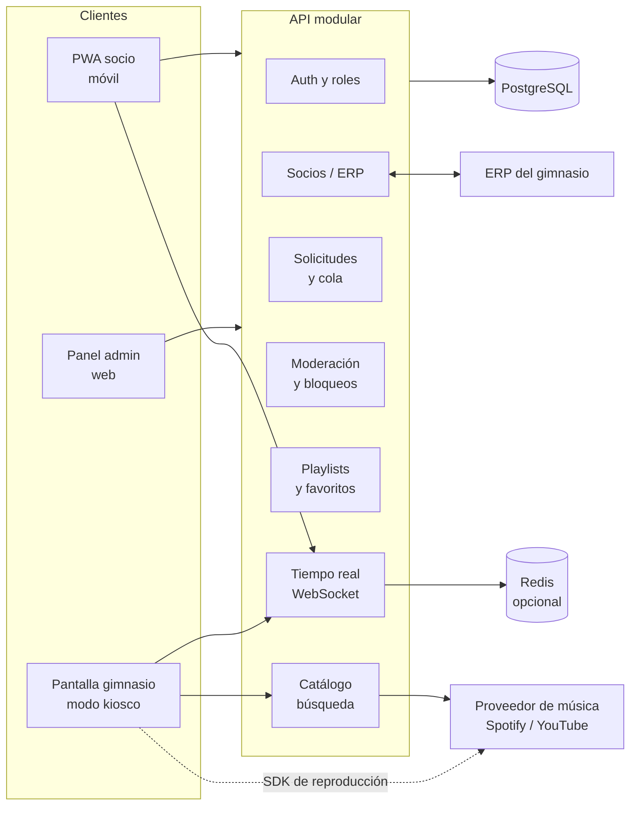

# Plan de implementación — Radio de gimnasio

> Documento vivo. Las decisiones marcadas como **(propuesta)** se pueden cambiar; las marcadas como **(pendiente)** necesitan respuesta antes de codificar esa parte.

---

## 1. Resumen

Aplicación web **mobile-first** (PWA) donde los socios del gimnasio inician sesión con sus credenciales, buscan una canción, la solicitan y ven en qué posición está en la cola. La reproducción ocurre en una **pantalla/altavoz del gimnasio** que ejecuta la cola controlada por nuestro servidor. Un **panel de administración** permite aprobar, rechazar y bloquear peticiones y gestionar usuarios.

### Decisiones clave (propuesta)

| Tema | Decisión |
|---|---|
| Nombre | **PulsoFM** (cambiable; el código usa un nombre de paquete fácil de renombrar) |
| Tipo de app | PWA (instalable desde el navegador del móvil, sin tienda de apps) |
| Fuente de verdad de la cola | Nuestro backend. Spotify/YouTube solo **ejecutan** lo que el backend indica |
| Dispositivo de reproducción | Un navegador en pantalla del gimnasio (modo kiosco) con cuenta de servicio |
| Integración con ERP | Capa de adaptadores: sincronización de socios y, opcionalmente, login delegado |
| Arquitectura | Monolito modular (un backend con módulos bien separados), no microservicios |

---

## 2. Arquitectura



**Principios**

- **Cola en el servidor.** Cada cambio (solicitud, aprobación, salto, reorden) pasa por el backend y se difunde por WebSocket a móviles, admin y pantalla.
- **Proveedor de música detrás de una interfaz** (`MusicProvider`): buscar, obtener metadatos y reproducir. Así se puede cambiar de Spotify a YouTube sin tocar la lógica de cola.
- **Integración con ERP detrás de una interfaz** (`MemberProvider`): sincronizar socios, validar credenciales o consultar estado (activo/moroso/suspendido).
- **Mobile-first real:** diseño desde 360 px, gutter de 16 px, sin scroll horizontal, controles con área táctil ≥ 44 px.

---

## 3. Reproducción de música

### Opciones evaluadas

| Opción | Pros | Contras |
|---|---|---|
| **Spotify Web API + Web Playback SDK** (cuenta Premium dedicada) | Catálogo amplio, metadatos ricos, control programático de la reproducción | Requiere Premium en la cuenta que reproduce; las condiciones de uso restringen el uso comercial/público |
| **YouTube IFrame Player API** | Gratis, sin cuenta de pago | Anuncios y calidad de audio variable; la búsqueda oficial tiene cuota; uso público sujeto a condiciones |
| **YouTube Music / Spotify como app externa del usuario** | Sin desarrollo de reproductor | No permite cola controlada por nosotros; descartado |

**Recomendación (propuesta):** Spotify Web API para búsqueda y metadatos + Web Playback SDK en la **pantalla del gimnasio**, con una cuenta de servicio Premium. El socio nunca reproduce con su propia cuenta.

### Advertencias que hay que validar antes de lanzar

1. **Licencia de música pública.** Reproducir música en un gimnasio es comunicación pública y requiere licencia de la sociedad de gestión colectiva de tu país, independientemente de la plataforma usada.
2. **Condiciones de Spotify / YouTube.** Revisar que el uso previsto (espacio comercial, cuenta de servicio, cola gestionada por terceros) esté permitido. Si no lo está, la capa `MusicProvider` permite cambiar de proveedor.
3. **Contenido explícito.** Filtrar por la marca `explicit` del proveedor y permitir bloqueo manual.

---

## 4. Funcionalidades

### 4.1 Socio (móvil)

**MVP**

- Inicio de sesión con credenciales del gimnasio.
- Buscar canciones (título, artista, álbum).
- Solicitar una canción → entra en la cola con su número de orden.
- Ver **mi solicitud**: estado (pendiente / aprobada / rechazada / reproducida) y posición actual.
- Ver la cola: **las 5 anteriores**, la que suena ahora y **las siguientes**.
- Mientras suena una canción: botón **Guardar** (favoritos o cualquier playlist propia).
- Playlists propias: crear, renombrar, borrar, añadir y quitar canciones.
- Historial de mis solicitudes.
- Límite configurable de solicitudes por socio (p. ej. 5 cada 30 min) para evitar spam.

**v2 (propuestas)**

- Votar canciones (“+1”) para subir prioridad en la cola.
- Notificación push cuando la canción solicitada esté a 2 puestos de sonar.
- Ver qué canciones ya están solicitadas para no repetir.
- Modo “sin solicitudes” (solo escuchar la radio).
- Preferencias de género o playlist temática por horario.

### 4.2 Pantalla del gimnasio (kiosco)

- Muestra canción actual, portada, barra de progreso y próximas 5 en pantalla grande.
- Se reconecta sola si cae la red o se reinicia el equipo.
- Pausa / reanudar / saltar desde el panel o desde un botón físico de la pantalla (acceso restringido).
- Modo emergencia: silencio o playlist de respaldo si el proveedor falla.

### 4.3 Staff / Administrador

**MVP**

- **Panel de solicitudes en tiempo real:** usuario, canción, hora, estado.
- **Aprobar o rechazar** cada solicitud (con motivo opcional).
- **Modo de moderación** configurable: automático (todo entra) o manual (todo espera aprobación).
- **Bloquear canción** (por ID de proveedor), **bloquear artista**, **bloquear por palabra clave** en título o artista.
- **Bloquear socio** de solicitar (temporal o permanente) con motivo.
- Control de cola: saltar, pausar, reordenar, quitar una solicitud.
- Gestión de socios: ver, buscar, activar, suspender, cambiar rol.
- **Auditoría:** quién aprobó, rechazó, bloqueó o saltó cada cosa, y cuándo.

**v2 (propuestas)**

- Estadísticas: canciones más pedidas, socios más activos, horas pico.
- Playlists de horario (mañana / tarde / noche) y programación automática.
- Reglas automáticas (p. ej. rechazar automáticamente canciones con `explicit` antes de las 10:00).
- Exportar reportes a CSV.
- Gestión de roles finos (instructor, recepción, admin total).

### 4.4 Roles

| Rol | Puede |
|---|---|
| `member` | Solicitar, guardar, gestionar sus playlists |
| `staff` | Todo lo de `member` + moderar solicitudes, bloquear canciones/artistas/socios, controlar cola |
| `admin` | Todo lo anterior + gestión de socios, configuración, auditoría |
| `display` | Cuenta técnica de la pantalla: solo lectura de la cola y ejecución de reproducción |

---

## 5. Integración con el ERP

**(pendiente)** Necesito saber qué ERP usan y cómo se puede acceder (API REST, base de datos, exportaciones, OAuth/OIDC, etc.). Mientras tanto, el diseño cubre los tres escenarios:

1. **ERP → PulsoFM (push).** El ERP llama a un endpoint `POST /integrations/erp/members` firmado con HMAC y una API key por integración. Crea, actualiza o desactiva socios.
2. **PulsoFM → ERP (pull).** Un job programado consulta el ERP cada N minutos o al iniciar sesión.
3. **Login delegado.** Si el ERP expone OIDC/OAuth, el login se hace contra el ERP y PulsoFM solo guarda el vínculo `external_id`.

**Regla de negocio:** el estado del socio en el ERP manda. Si está suspendido o moroso, no puede iniciar sesión ni solicitar canciones, aunque la cuenta local exista.

**Vínculo:** cada socio tiene `external_id` (ID del ERP). Así la integración no depende del correo ni del nombre.

**Entregables de integración:** documentación del contrato (OpenAPI), pruebas con datos de prueba del ERP, y un modo “sandbox”.

---

## 6. Modelo de datos (borrador)

```
users            id, external_id (unique, nullable), name, email, phone,
                 password_hash (nullable si login delegado), role,
                 status (active|suspended|inactive), created_at

tracks           id, provider, provider_track_id (unique por provider),
                 title, artist, album, duration_ms, cover_url, explicit,
                 cached_at                       -- caché de metadatos

requests         id, user_id, track_id, status (pending|approved|rejected|
                 played|skipped|removed), position, reason,
                 decided_by, decided_at, created_at

playback_state   id (singleton), current_request_id, paused, progress_ms,
                 updated_at

playlists        id, user_id, name, created_at
playlist_items   playlist_id, track_id, position, added_at
favorites        user_id, track_id, created_at

blocklist        id, type (track|artist|keyword|explicit), value, reason,
                 created_by, created_at

user_blocks      id, user_id, kind (requests|account), expires_at (nullable),
                 reason, created_by, created_at

settings         key, value (json)        -- moderación, límites, horarios
audit_log        id, actor_id, action, entity, entity_id, payload, created_at
```

Índices clave: `requests(status, position)`, `requests(user_id, created_at)` (para el límite por socio), `blocklist(type, value)`.

---

## 7. API (resumen)

| Área | Endpoints principales |
|---|---|
| Auth | `POST /auth/login`, `POST /auth/refresh`, `POST /auth/logout`, `GET /me` |
| Catálogo | `GET /tracks/search?q=`, `GET /tracks/:id` |
| Solicitudes | `POST /requests`, `GET /requests/mine`, `GET /queue` (anteriores, actual, siguientes) |
| Playlists | `GET/POST /playlists`, `PATCH/DELETE /playlists/:id`, `POST/DELETE /playlists/:id/items/:trackId` |
| Favoritos | `PUT/DELETE /favorites/:trackId` |
| Moderación | `GET /admin/requests`, `POST /admin/requests/:id/approve`, `POST /admin/requests/:id/reject`, `POST /admin/blocklist`, `DELETE /admin/blocklist/:id` |
| Socios | `GET /admin/users`, `PATCH /admin/users/:id`, `POST /admin/users/:id/block` |
| Reproductor | `POST /player/next`, `POST /player/pause`, `POST /player/resume`, `POST /admin/queue/reorder` |
| Integración | `POST /integrations/erp/members` (HMAC) |
| Tiempo real | Eventos `queue:updated`, `playback:changed`, `request:status`, `blocklist:changed` |

Las respuestas de error usan un formato único `{ code, message, details }`. Documentación OpenAPI generada desde el backend.

---

## 8. Stack tecnológico (propuesta)

| Capa | Tecnología | Motivo |
|---|---|---|
| Lenguaje | TypeScript en todo el repo | Tipos compartidos entre front y back |
| Monorepo | pnpm workspaces + Turborepo | Un solo repo, paquetes compartidos |
| Frontend (socio, admin, pantalla) | React + Vite + TailwindCSS | Rápido, ecosistema amplio, buen soporte PWA |
| PWA | vite-plugin-pwa | Instalable, caché de la app |
| Estado / datos | TanStack Query + Zustand | Caché de servidor y estado local simple |
| Validación compartida | Zod (en `packages/shared`) | Mismos esquemas en cliente y servidor |
| Backend | NestJS + Fastify adapter | Módulos, guards por rol, Swagger integrado |
| Tiempo real | Socket.IO | Reconexión automática, salas por rol |
| Base de datos | PostgreSQL + Prisma | Relacional, migraciones versionadas |
| Caché / sesiones | Redis (opcional en fase 1) | Límites de solicitudes y escalado de sockets |
| Auth | JWT corto + refresh token en cookie httpOnly | Seguro para móvil y panel |
| Pruebas | Vitest (unitarias), Supertest (API), Playwright (e2e móvil) | Cobertura en las tres capas |
| Calidad | ESLint, Prettier, Husky + lint-staged, Commitlint | Commits y código consistentes |
| CI | GitHub Actions | Lint, tipos, tests y build en cada PR |
| Despliegue | Docker Compose (api, web, db, redis) en un VPS | Simple, portable, fácil de mover |

---

## 9. Estructura del repositorio (propuesta)

```
prueba-radio/
├── apps/
│   ├── api/            # NestJS: módulos auth, members, requests, queue, moderation, playlists, catalog, integrations
│   ├── web/            # PWA: rutas /app (socio), /admin (staff), /display (pantalla)
├── packages/
│   ├── shared/         # Zod schemas, tipos, constantes de rol y estado
│   └── music-providers/# MusicProvider: spotify/, youtube/ (interfaz + implementaciones)
├── prisma/             # schema.prisma y migraciones
├── docs/
│   ├── plan-implementacion.md
│   ├── api/            # OpenAPI exportado
│   └── erp-integration.md
├── docker-compose.yml
├── .github/workflows/  # CI
└── README.md
```

---

## 10. Fases y commits

Cada fase termina con la app funcionando y pruebas pasando. Un commit por unidad lógica, con Conventional Commits (`feat:`, `fix:`, `chore:`, `docs:`, `test:`).

### Fase 0 — Base del proyecto
- `chore: inicializar monorepo con pnpm y Turborepo`
- `chore: configurar TypeScript, ESLint, Prettier y Commitlint`
- `chore: añadir Docker Compose con PostgreSQL y Redis`
- `ci: añadir workflow de lint, tipos y tests`

**Hecho cuando:** `pnpm install && pnpm build && pnpm test` pasan en CI.

### Fase 1 — Socios y autenticación
- `feat(api): modelo de usuarios y roles con Prisma`
- `feat(api): login con JWT y refresh token en cookie httpOnly`
- `feat(api): guards por rol (member, staff, admin, display)`
- `feat(web): pantalla de login mobile-first`
- `feat(api): interfaz MemberProvider y adaptador local`

**Hecho cuando:** un socio inicia sesión en el móvil y un endpoint protegido responde según su rol.

### Fase 2 — Catálogo y búsqueda
- `feat(music): interfaz MusicProvider y adaptador de Spotify`
- `feat(api): búsqueda de canciones con caché en tabla tracks`
- `feat(web): buscador con resultados en lista táctil`

**Hecho cuando:** un socio busca y ve resultados con portada, título y artista.

### Fase 3 — Solicitudes y cola
- `feat(api): crear solicitud con validación de límite por socio`
- `feat(api): cola con anteriores (5), actual y siguientes`
- `feat(api): filtro de blocklist al crear solicitud`
- `feat(realtime): eventos de cola por WebSocket`
- `feat(web): “mis solicitudes” con estado y posición`
- `feat(web): vista de cola para el socio`

**Hecho cuando:** un socio pide una canción, ve su número de orden y ve cómo avanza la cola en tiempo real.

### Fase 4 — Reproducción en pantalla del gimnasio
- `feat(display): reproductor con Spotify Web Playback SDK`
- `feat(display): modo kiosco con reconexión automática`
- `feat(api): máquina de estados de reproducción (siguiente, pausa, reanudar)`
- `feat(display): vista de canción actual y próximas 5`

**Hecho cuando:** la pantalla reproduce la cola en orden y se recupera sola tras un corte.

### Fase 5 — Experiencia del socio
- `feat(api): favoritos y playlists CRUD`
- `feat(web): botón “Guardar” en la reproducción actual`
- `feat(web): gestión de playlists propias`
- `feat(web): historial de solicitudes`

**Hecho cuando:** un socio guarda una canción que suena y la encuentra en su playlist.

### Fase 6 — Moderación y administración
- `feat(api): aprobar, rechazar y quitar solicitudes`
- `feat(api): blocklist por canción, artista y palabra clave`
- `feat(api): bloqueo de socios (temporal o permanente)`
- `feat(api): modo de moderación automático / manual`
- `feat(api): auditoría de acciones de staff`
- `feat(web): panel admin de solicitudes en tiempo real`
- `feat(web): gestión de blocklist y socios`
- `feat(web): control de cola (saltar, pausar, reordenar)`

**Hecho cuando:** staff ve usuario y canción de cada solicitud, la rechaza o bloquea, y queda registro en auditoría.

### Fase 7 — Integración con ERP
- `feat(api): endpoint de sincronización con firma HMAC`
- `feat(api): adaptador ERP según contrato real (pendiente)`
- `feat(api): bloqueo automático de socios suspendidos en el ERP`
- `docs: contrato de integración en docs/erp-integration.md`

**Hecho cuando:** un socio suspendido en el ERP no puede entrar ni pedir canciones, y el cambio se refleja sin intervención manual.

### Fase 8 — Endurecimiento y lanzamiento
- `test(e2e): flujos de socio, staff y pantalla con Playwright en móvil`
- `feat(web): instalación como PWA y caché offline del shell`
- `perf: límites de tasa y revisión de consultas`
- `chore: despliegue en VPS con Docker Compose y variables de entorno`
- `docs: manual de operación para recepción`

---

## 11. Riesgos

| Riesgo | Impacto | Mitigación |
|---|---|---|
| Licencia de música pública no contratada | Alto (legal) | Validar antes de la fase 4; contratar licencia |
| Condiciones de Spotify/YouTube no permiten el uso previsto | Alto | Validar en fase 2; `MusicProvider` permite cambiar |
| Caída de la pantalla o de la red del gimnasio | Medio | Reconexión automática y playlist de respaldo |
| ERP sin API utilizable | Medio | Plan B: importación CSV programada o login propio |
| Socios piden la misma canción repetida | Bajo | Límite por socio y aviso “ya está en cola” |
| Contenido inapropiado | Medio | Blocklist, filtro `explicit`, modo manual |

---

## 12. Preguntas abiertas

1. **ERP:** ¿cuál es y qué acceso tienen (API, base de datos, exportaciones, OIDC)?
2. **Login:** ¿los socios entran con las mismas credenciales del ERP o quieren una cuenta propia en la app?
3. **Música:** ¿tienen cuenta Spotify Premium para la pantalla o prefieren YouTube? ¿Ya tienen licencia de música pública?
4. **Moderación:** ¿las solicitudes entran automáticamente o las aprueba siempre el staff?
5. **Límite:** ¿cuántas solicitudes por socio y por cuánto tiempo?
6. **Pantalla:** ¿qué equipo se usará (TV con navegador, mini PC, tablet fija) y cómo se conecta a los altavoces?
7. **Idioma:** ¿solo español o también otros idiomas?
8. **Nombre:** ¿aprueban PulsoFM o prefieren otro?

---

## 13. Siguientes pasos

1. Responder las preguntas abiertas (sobre todo ERP y música).
2. Aprobar este plan.
3. Empezar por la **Fase 0** y continuar en orden. Cada fase se entrega como una serie de commits en `claude/gym-radio-app-mruzmi`.
