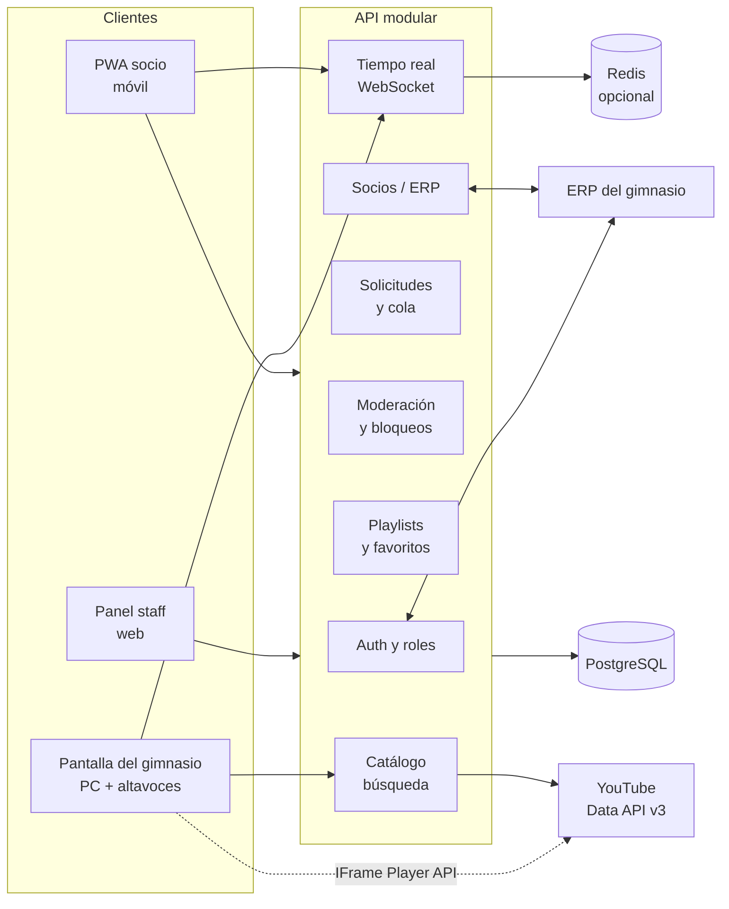

# Plan de implementación — PulsoFM (radio de gimnasio)

> Documento vivo. Las decisiones marcadas como **(confirmada)** vienen de tus respuestas. Las marcadas como **(propuesta)** se pueden cambiar. Las marcadas como **(pendiente)** necesitan un dato antes de codificar esa parte.

---

## 1. Resumen

Aplicación web **mobile-first** (PWA) donde los socios del gimnasio inician sesión con **sus mismas credenciales del ERP**, buscan una canción, la solicitan y ven su número de orden en la cola. La reproducción ocurre en una **PC conectada a los altavoces** del gimnasio, que ejecuta la cola controlada por nuestro servidor. Las solicitudes entran automáticamente; el **staff** puede ver la cola, saltar una canción o eliminarla de la lista de espera.

### Decisiones clave

| Tema                        | Decisión                                                                                                        | Estado       |
| --------------------------- | --------------------------------------------------------------------------------------------------------------- | ------------ |
| Nombre                      | **PulsoFM**                                                                                                     | (confirmada) |
| Login                       | Mismas credenciales del ERP; el ERP es la fuente de verdad del estado del socio                                 | (confirmada) |
| Música                      | **YouTube** (YouTube Data API v3 para búsqueda, YouTube IFrame Player API para reproducir). Gratis, sin Premium | (confirmada) |
| Moderación                  | Solicitudes automáticas. Staff: ver, saltar y eliminar de la cola                                               | (confirmada) |
| Límites                     | 5 solicitudes cada 30 min en total y 1 cada 6 min por socio                                                     | (confirmada) |
| Pantalla                    | PC con navegador en pantalla completa, salida de audio a los altavoces                                          | (confirmada) |
| Idiomas                     | Español e inglés desde el inicio                                                                                | (confirmada) |
| Fuente de verdad de la cola | Nuestro backend. YouTube solo **ejecuta** lo que el backend indica                                              | (propuesta)  |
| Integración con ERP         | Capa de adaptadores + ejemplo documentado en `docs/erp-integration.md`                                          | (propuesta)  |
| Arquitectura                | Monolito modular, no microservicios                                                                             | (propuesta)  |

---

## 2. Arquitectura



**Principios**

- **Cola en el servidor.** Cada cambio (solicitud, salto, eliminación, reorden) pasa por el backend y se difunde por WebSocket a móviles, panel y pantalla.
- **Proveedor de música detrás de una interfaz** (`MusicProvider`): buscar, obtener metadatos y reproducir. Cambiar de YouTube a otro proveedor no toca la lógica de cola.
- **Integración con ERP detrás de una interfaz** (`MemberProvider`): validar credenciales, consultar estado y sincronizar socios.
- **Mobile-first real:** diseño desde 360 px, gutter de 16 px, sin scroll horizontal, controles con área táctil ≥ 44 px.
- **Idiomas:** todos los textos salen de archivos de traducción (`es`, `en`) desde la primera pantalla.

---

## 3. Reproducción de música

### Decisión (confirmada)

Se usa **YouTube** porque es gratuito y no requiere cuenta Premium.

| Pieza                         | Uso                                                                                     | Límite a tener en cuenta                                                                                                                                                                                 |
| ----------------------------- | --------------------------------------------------------------------------------------- | -------------------------------------------------------------------------------------------------------------------------------------------------------------------------------------------------------- |
| **YouTube Data API v3**       | Buscar canciones y obtener título, artista (canal), portada y duración                  | Cuota diaria de **10 000 unidades**. Una búsqueda cuesta **100 unidades**, es decir, unas 100 búsquedas al día con la cuota por defecto. Hay que cachear resultados y limitar la búsqueda con _debounce_ |
| **YouTube IFrame Player API** | Reproducir en la pantalla del gimnasio, con control de play, pausa, siguiente y volumen | Puede mostrar anuncios; el video debe permitir incrustarse                                                                                                                                               |

### Filtros de calidad al buscar

- Solo videos de la categoría **Música** (`videoCategoryId = 10`).
- Solo videos con `status.embeddable = true` (verificado con `videos.list`, 1 unidad por lote de hasta 50).
- Se descartan videos marcados como no disponibles o sin duración válida.

### Otras opciones descartadas

| Opción                                   | Motivo                                                                                          |
| ---------------------------------------- | ----------------------------------------------------------------------------------------------- |
| Spotify Web Playback SDK                 | Requiere cuenta **Premium** para reproducir desde la app, así que no cumple con gratuito        |
| YouTube Music / Spotify como app externa | No permite cola controlada por nosotros                                                         |
| Jamendo (música libre)                   | Catálogo pequeño para radio de gimnasio. Es una alternativa si después necesitan licencia clara |

### Advertencias

1. **Proyecto académico.** Con YouTube gratuito está bien para una prueba. Para un gimnasio real habría que revisar las condiciones de uso de YouTube y la **licencia de música pública** de su país, porque reproducir música en un espacio abierto al público es comunicación pública.
2. **Autoplay.** El navegador bloquea el audio hasta que el usuario hace clic una vez. La pantalla necesita un botón “Iniciar radio” tras cada reinicio.
3. **Contenido explícito.** YouTube no siempre marca letras explícitas. Por eso el staff puede bloquear canciones o palabras manualmente.

---

## 4. Funcionalidades

### 4.1 Socio (móvil)

**MVP**

- Inicio de sesión con usuario y contraseña del ERP.
- Buscar canciones (título, artista).
- Solicitar una canción → entra automáticamente a la cola con su número de orden.
- Ver **mis solicitudes**: estado (en cola / sonando / reproducida / eliminada / bloqueada) y posición actual.
- Ver la cola: **las 5 anteriores**, la que suena ahora y **las siguientes**.
- Límites visibles: “Te quedan 3 solicitudes · próxima en 4 min”.
- Mientras suena una canción: botón **Guardar** (favoritos o cualquiera de mis playlists).
- Playlists propias: crear, renombrar, borrar, añadir y quitar canciones.
- Historial de mis solicitudes.
- Cambio de idioma (es / en).

**v2 (propuestas)**

- Votar canciones (“+1”) para subir prioridad en la cola.
- Notificación cuando la canción solicitada esté a 2 puestos de sonar.
- Aviso “ya está en cola” para evitar duplicados.
- Modo “solo escuchar” sin solicitudes.

### 4.2 Pantalla del gimnasio

- PC con navegador en pantalla completa, abierta en la ruta `/display`, con arranque automático al iniciar sesión en el equipo.
- Salida de audio de la PC a los altavoces (conexión por jack de 3.5 mm, HDMI o USB según el equipo).
- Muestra canción actual, portada, barra de progreso y las siguientes 5 en pantalla grande.
- Se reconecta sola si cae la red y vuelve a pedir el estado completo de la cola.
- Modo respaldo: si YouTube falla en una canción, la salta y avisa en el panel del staff.

### 4.3 Staff / Administrador

**MVP**

- **Panel de solicitudes en tiempo real:** usuario, canción, hora y posición en cola.
- **Saltar** la canción que suena.
- **Eliminar** una solicitud de la lista de espera (con motivo opcional, visible para el socio).
- **Bloquear canción**, **bloquear artista** o **bloquear palabra clave**. Las solicitudes que coincidan se rechazan automáticamente con un mensaje al socio.
- **Bloquear socio** para que no pueda solicitar (temporal o permanente), con motivo.
- Pausar y reanudar la reproducción.
- Reordenar la cola (arrastrar o “subir / bajar”).
- Ver socios y su estado sincronizado con el ERP (solo lectura en el panel; el cambio se hace en el ERP).
- **Auditoría:** quién saltó, eliminó, bloqueó o desbloqueó cada cosa, y cuándo.

**v2 (propuestas)**

- Estadísticas: canciones más pedidas, socios más activos, horas pico.
- Playlists por horario (mañana / tarde / noche).
- Exportar reportes a CSV.
- Roles finos (instructor, recepción, admin total).

### 4.4 Límites de solicitudes (confirmados)

| Regla                                                | Valor             | Configurable en |
| ---------------------------------------------------- | ----------------- | --------------- |
| Solicitudes por socio en una ventana móvil           | **5 cada 30 min** | `settings`      |
| Intervalo mínimo entre solicitudes de un mismo socio | **1 cada 6 min**  | `settings`      |

Ambas reglas se aplican en el backend. Si el socio supera alguna, la respuesta indica el código (`REQUEST_COOLDOWN` o `REQUEST_QUOTA_EXCEEDED`) y cuánto debe esperar (`retry_after`). Las cuentas bloqueadas por staff no pueden solicitar.

### 4.5 Roles

| Rol       | Puede                                                                                                                               |
| --------- | ----------------------------------------------------------------------------------------------------------------------------------- |
| `member`  | Solicitar, guardar, gestionar sus playlists                                                                                         |
| `staff`   | Todo lo de `member` + ver cola, saltar, eliminar solicitudes, bloquear canciones / artistas / palabras / socios, pausar y reordenar |
| `admin`   | Todo lo anterior + configuración de límites, ver auditoría, forzar sincronización con el ERP                                        |
| `display` | Cuenta técnica de la pantalla: lee la cola y ejecuta la reproducción. No puede editar nada                                          |

---

## 5. Integración con el ERP

**Login (confirmado):** los socios entran con las mismas credenciales del ERP. PulsoFM **no guarda contraseñas**.

Flujo de inicio de sesión:

1. El socio envía usuario y contraseña a `POST /auth/login`.
2. PulsoFM llama al ERP mediante `MemberProvider.validateCredentials()`.
3. Si las credenciales son válidas **y** el socio está `active` en el ERP, se crea o actualiza su registro local (`external_id`) y se emite la sesión.
4. En cada renovación de token (cada 15 min) se vuelve a consultar el estado del socio. Si el ERP lo marca como suspendido o moroso, la sesión se cierra.

**Regla de negocio:** el estado del socio en el ERP manda. Un socio suspendido o moroso no puede iniciar sesión ni solicitar canciones, aunque su cuenta local exista.

**(pendiente)** Necesito el nombre del ERP y cómo se accede (API REST, base de datos, exportaciones, OIDC). Mientras tanto, `docs/erp-integration.md` contiene un **ejemplo completo** con un ERP ficticio: contrato, flujo de login, sincronización firmada con HMAC y un adaptador de ejemplo.

Escenarios cubiertos por el diseño:

1. **Login contra el ERP** (arriba).
2. **ERP → PulsoFM (push).** El ERP envía cambios de socios a `POST /integrations/erp/members` firmado con HMAC.
3. **PulsoFM → ERP (pull).** Un job cada 15 min consulta socios modificados desde la última sincronización, como respaldo del push.

---

## 6. Modelo de datos (borrador)

```
users            id, external_id (unique), name, username, role,
                 status (active|suspended|inactive), last_synced_at, created_at
                 -- sin contraseña: la valida el ERP

tracks           id, provider ('youtube'), provider_track_id (unique por provider),
                 title, artist, duration_ms, cover_url, embeddable, category,
                 cached_at                       -- caché de búsquedas y metadatos

requests         id, user_id, track_id, status (queued|playing|played|skipped|
                 removed|blocked), position, reason, decided_by, created_at

playback_state   id (singleton), current_request_id, paused, progress_ms,
                 updated_at

playlists        id, user_id, name, created_at
playlist_items   playlist_id, track_id, position, added_at
favorites        user_id, track_id, created_at

blocklist        id, type (track|artist|keyword), value, reason,
                 created_by, created_at

user_blocks      id, user_id, expires_at (nullable), reason, created_by, created_at

settings         key, value (json)               -- límites, cuota, idioma por defecto
audit_log        id, actor_id, action, entity, entity_id, payload, created_at
```

Índices clave: `requests(status, position)`, `requests(user_id, created_at)` (para los límites), `blocklist(type, value)`, `tracks(provider, provider_track_id)`.

---

## 7. API (resumen)

| Área             | Endpoints principales                                                                                                                        |
| ---------------- | -------------------------------------------------------------------------------------------------------------------------------------------- |
| Auth             | `POST /auth/login` (credenciales del ERP), `POST /auth/refresh`, `POST /auth/logout`, `GET /me`                                              |
| Catálogo         | `GET /tracks/search?q=` (con caché), `GET /tracks/:id`                                                                                       |
| Solicitudes      | `POST /requests`, `GET /requests/mine`, `GET /queue` (5 anteriores, actual, siguientes)                                                      |
| Playlists        | `GET/POST /playlists`, `PATCH/DELETE /playlists/:id`, `POST/DELETE /playlists/:id/items/:trackId`                                            |
| Favoritos        | `PUT/DELETE /favorites/:trackId`                                                                                                             |
| Staff — cola     | `POST /staff/queue/skip`, `DELETE /staff/requests/:id`, `POST /staff/queue/reorder`, `POST /staff/player/pause`, `POST /staff/player/resume` |
| Staff — bloqueos | `GET/POST /staff/blocklist`, `DELETE /staff/blocklist/:id`, `POST /staff/users/:id/block`, `DELETE /staff/users/:id/block`                   |
| Staff — socios   | `GET /staff/users` (solo lectura, sincronizado con el ERP)                                                                                   |
| Admin            | `GET/PATCH /admin/settings`, `GET /admin/audit`, `POST /admin/erp/sync`                                                                      |
| Integración      | `POST /integrations/erp/members` (firmado con HMAC)                                                                                          |
| Tiempo real      | Eventos `queue:updated`, `playback:changed`, `request:status`, `blocklist:changed`                                                           |

Las respuestas de error usan un formato único `{ code, message, details }`. Documentación OpenAPI generada desde el backend.

---

## 8. Stack tecnológico (propuesta)

| Capa                              | Tecnología                                                      | Motivo                                     |
| --------------------------------- | --------------------------------------------------------------- | ------------------------------------------ |
| Lenguaje                          | TypeScript en todo el repo                                      | Tipos compartidos entre front y back       |
| Monorepo                          | pnpm workspaces + Turborepo                                     | Un solo repo, paquetes compartidos         |
| Frontend (socio, staff, pantalla) | React + Vite + TailwindCSS                                      | Rápido, buen soporte PWA                   |
| PWA                               | vite-plugin-pwa                                                 | Instalable, caché de la app                |
| Idiomas                           | react-i18next (es, en)                                          | Textos fuera del código desde el inicio    |
| Estado / datos                    | TanStack Query + Zustand                                        | Caché de servidor y estado local simple    |
| Validación compartida             | Zod (en `packages/shared`)                                      | Mismos esquemas en cliente y servidor      |
| Backend                           | NestJS + Fastify adapter                                        | Módulos, guards por rol, Swagger integrado |
| Tiempo real                       | Socket.IO                                                       | Reconexión automática, salas por rol       |
| Base de datos                     | PostgreSQL + Prisma                                             | Relacional, migraciones versionadas        |
| Caché / límites                   | Redis (opcional en fase 1)                                      | Ventanas de límite y escalado de sockets   |
| Auth                              | JWT corto + refresh token en cookie httpOnly                    | Seguro para móvil y panel                  |
| Pruebas                           | Vitest (unitarias), Supertest (API), Playwright (e2e móvil)     | Cobertura en las tres capas                |
| Calidad                           | ESLint, Prettier, Husky + lint-staged, Commitlint               | Commits y código consistentes              |
| CI                                | GitHub Actions                                                  | Lint, tipos, tests y build en cada PR      |
| Despliegue                        | Docker Compose (api, web, db, redis) en un VPS o en la misma PC | Simple, portable                           |

---

## 9. Estructura del repositorio (propuesta)

```
prueba-radio/
├── apps/
│   ├── api/            # NestJS: auth, members, requests, queue, moderation, playlists, catalog, integrations
│   └── web/            # PWA: rutas /app (socio), /staff (staff), /display (pantalla)
├── packages/
│   ├── shared/         # Zod schemas, tipos, roles, estados, textos (es/en)
│   └── music-providers/# MusicProvider + youtube/ (búsqueda y player)
├── prisma/             # schema.prisma y migraciones
├── docs/
│   ├── plan-implementacion.md
│   ├── erp-integration.md   # ejemplo de integración con un ERP
│   └── api/            # OpenAPI exportado
├── docker-compose.yml
├── .github/workflows/  # CI
└── README.md
```

---

## 10. Fases y commits

Cada fase termina con la app funcionando y pruebas pasando. Un commit por unidad lógica, con Conventional Commits (`feat:`, `fix:`, `chore:`, `docs:`, `test:`).

### Fase 0 — Base del proyecto

- `chore: inicializar monorepo con pnpm y Turborepo`
- `chore: configurar TypeScript, ESLint, Prettier y Commitlint`
- `chore: añadir Docker Compose con PostgreSQL y Redis`
- `ci: añadir workflow de lint, tipos y tests`

**Hecho cuando:** `pnpm install && pnpm build && pnpm test` pasan en CI.

### Fase 1 — Socios y autenticación con credenciales del ERP

- `feat(api): modelo de usuarios y roles con Prisma`
- `feat(api): interfaz MemberProvider y adaptador de ejemplo (ERP ficticio)`
- `feat(api): login contra el ERP y sesión con JWT + refresh token`
- `feat(api): revalidación de estado del socio en cada refresh`
- `feat(api): guards por rol (member, staff, admin, display)`
- `feat(web): pantalla de login mobile-first (es/en)`

**Hecho cuando:** un socio entra con sus credenciales del ERP y, si el ERP lo marca como suspendido, la sesión se cierra.

### Fase 2 — Catálogo y búsqueda

- `feat(music): interfaz MusicProvider y adaptador de YouTube Data API`
- `feat(api): búsqueda con filtros (categoría Música, embeddable) y caché en tracks`
- `feat(api): control de cuota diaria de YouTube`
- `feat(web): buscador con resultados en lista táctil`

**Hecho cuando:** un socio busca y ve resultados con portada, título y artista, sin superar la cuota diaria.

### Fase 3 — Solicitudes, límites y cola

- `feat(api): crear solicitud con límites 5/30 min y 1/6 min`
- `feat(api): filtro de blocklist y de socios bloqueados al solicitar`
- `feat(api): cola con 5 anteriores, actual y siguientes`
- `feat(realtime): eventos de cola por WebSocket`
- `feat(web): “mis solicitudes” con estado, posición y límites restantes`
- `feat(web): vista de cola para el socio`

**Hecho cuando:** un socio pide una canción, ve su número de orden, ve el límite restante y ve avanzar la cola en tiempo real.

### Fase 4 — Reproducción en la pantalla del gimnasio

- `feat(display): reproductor con YouTube IFrame Player API`
- `feat(display): botón de inicio y modo pantalla completa`
- `feat(display): reconexión automática y resincronización de la cola`
- `feat(api): máquina de estados de reproducción (siguiente, pausa, reanudar)`
- `feat(display): vista de canción actual y próximas 5`

**Hecho cuando:** la PC reproduce la cola en orden por los altavoces y se recupera sola tras un corte de red.

### Fase 5 — Experiencia del socio

- `feat(api): favoritos y playlists CRUD`
- `feat(web): botón “Guardar” en la reproducción actual`
- `feat(web): gestión de playlists propias`
- `feat(web): historial de solicitudes`

**Hecho cuando:** un socio guarda una canción que suena y la encuentra en su playlist.

### Fase 6 — Panel de staff

- `feat(api): saltar canción actual y eliminar solicitudes de la cola`
- `feat(api): blocklist por canción, artista y palabra clave`
- `feat(api): bloqueo de socios (temporal o permanente)`
- `feat(api): auditoría de acciones de staff`
- `feat(web): panel de solicitudes en tiempo real (usuario y canción)`
- `feat(web): acciones de saltar, eliminar, pausar y reordenar`
- `feat(web): gestión de blocklist y socios`

**Hecho cuando:** staff ve usuario y canción de cada solicitud, puede saltarla o eliminarla, bloquear una canción o socio, y queda registro en auditoría.

### Fase 7 — Integración con ERP

- `feat(api): endpoint de sincronización con firma HMAC`
- `feat(api): job de sincronización cada 15 min (pull de respaldo)`
- `feat(api): adaptador ERP según contrato real (pendiente)`
- `docs: ejemplo de integración en docs/erp-integration.md`

**Hecho cuando:** un cambio de estado en el ERP se refleja en PulsoFM sin intervención manual.

### Fase 8 — Endurecimiento y entrega

- `test(e2e): flujos de socio, staff y pantalla con Playwright en móvil`
- `feat(web): instalación como PWA y caché offline del shell`
- `perf: revisión de consultas y de cuota de YouTube`
- `chore: despliegue con Docker Compose y variables de entorno`
- `docs: manual de uso para el staff`

---

## 11. Riesgos

| Riesgo                                          | Impacto      | Mitigación                                                                           |
| ----------------------------------------------- | ------------ | ------------------------------------------------------------------------------------ |
| Se agota la cuota diaria de YouTube (10 000 u.) | Alto         | Caché de búsquedas, _debounce_ en el buscador, monitor de cuota en el panel de admin |
| Video no incrustable o con anuncios             | Medio        | Filtro `embeddable`, salto automático y aviso al staff                               |
| ERP sin API utilizable                          | Alto         | Plan B: importación CSV programada o cuentas locales temporales                      |
| Caída de la PC o de la red del gimnasio         | Medio        | Arranque automático, reconexión y modo respaldo                                      |
| Socios piden la misma canción repetida          | Bajo         | Aviso “ya está en cola” (v2) y límites por socio                                     |
| Contenido inapropiado                           | Medio        | Blocklist, filtro manual, eliminación por staff                                      |
| Uso comercial sin licencia de música pública    | Alto (legal) | Mantener el proyecto académico; validar licencia antes de un despliegue real         |

---

## 12. Preguntas abiertas

Ya quedaron resueltas: login, música, moderación, límites, pantalla, idioma y nombre.

1. **ERP:** ¿cuál es y qué acceso tienen (API REST, base de datos, exportaciones, OIDC)? Con esto se reemplaza el ERP ficticio de `docs/erp-integration.md`.
2. **Entorno:** ¿la PC de la pantalla ya está elegida? Con eso se define si la app corre en la misma PC o en un servidor aparte.

---

## 13. Siguientes pasos

1. Responder la pregunta del ERP (la pregunta 2 es opcional para empezar).
2. Empezar por la **Fase 0** y continuar en orden. Cada fase se entrega como una serie de commits en `claude/gym-radio-app-mruzmi`.
